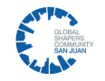

# Tu Voto No Se Deja

**Tu Voto No Se Deja** surge a raíz del deseo de la ACLU de Puerto Rico de empoderar al pueblo por medio de la educación electoral; nuestro enfoque es proveer información para que quien decida llevar a cabo su derecho al voto, lo haga con conocimiento.

## Sobre Nosotros

 **ACLU de Puerto Rico** es una organización no sectaria, sin fines de lucro cuyo propósito es adelantar los derechos civiles, constitucionales y humanos de todas las personas. Nuestro interés principal es que a través de nuestro esfuerzo se ayude a establecer una política pública robusta que promueva la protección de derechos humanos fundamentales para todas las personas, el respeto a la diversidad, la participación comunitaria en la toma de decisiones y abrir el acceso a la justicia a los sectores tradicionalmente desaventajados.

### Global Shapers San Juan

**Global Shapers** es una red global de jóvenes que promueven diálogo, acción y cambio en sus comunidades. El San Juan Hub es compuesto por 32 jóvenes de diversos trasfondos profesionales. En colaboración con la ACLU lanzaron esta página para lograr que más jóvenes aprendan sobre las plataformas de los candidatos antes de votar.
